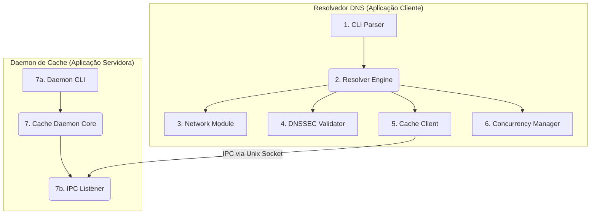

# Documento de Arquitetura: Resolvedor DNS Validante
**Versão:** 1.0
**Status:** Aprovado

## 1. Visão Geral da Arquitetura

O sistema foi projetado com uma **arquitetura modular e orientada a componentes** para promover a separação de preocupações, testabilidade e manutenibilidade.

Ele é composto por duas aplicações principais: o **Resolvedor DNS (Aplicação Cliente)** e o **Daemon de Cache (Aplicação Servidora)**. A comunicação entre eles é feita via Comunicação Inter-Processos (IPC), utilizando **Sockets de Domínio Unix** для máxima eficiência e segurança em ambiente local.



## 2. Descrição dos Componentes

  * **CLI Parser (main.cpp):** Ponto de entrada da aplicação. Responsável por analisar todos os argumentos da linha de comando e configurar o `ResolverEngine`.
  * **Resolver Engine (ResolverEngine):** O cérebro da aplicação. Orquestra o fluxo de resolução, gerenciando a lógica recursiva, seguindo delegações (NS) e CNAMEs. Utiliza os outros módulos para executar suas tarefas.
  * **Network Module (NetworkModule):** Abstrai toda a comunicação de rede de baixo nível (UDP, TCP, TLS). Isola o código de sockets do resto da aplicação. Depende da biblioteca `OpenSSL` para a implementação de TLS.
  * **DNSSEC Validator (DNSSECValidator):** Encapsula toda a lógica criptográfica para a validação da cadeia de confiança DNSSEC (DS -\> DNSKEY -\> RRSIG). Depende da biblioteca `OpenSSL` para as operações de hash e verificação de assinatura.
  * **Cache Client (CacheClient):** Módulo dentro do resolvedor principal que se comunica com o Daemon de Cache via IPC. Trata falhas de conexão de forma elegante, permitindo que o resolvedor funcione mesmo se o cache estiver offline.
  * **Concurrency Manager (ThreadPool):** Gerencia o pool de threads (`--workers`) para processar consultas simultâneas e implementa a lógica de `fan-out` para consultar múltiplos servidores de nomes em paralelo.
  * **Cache Daemon (Aplicação Separada):** Um processo de background persistente que fornece serviços de cache. É composto por:
      * **Daemon CLI:** Interface de linha de comando para gerenciar o daemon (`--activate`, `--set`, `--list`, etc.).
      * **IPC Listener:** Ouve por conexões do `CacheClient` em um socket de domínio Unix.
      * **Cache Core:** Implementa o armazenamento em memória para caches positivos e negativos, respeitando os TTLs e garantindo a segurança de threads (thread-safety).

## 3. Justificativas das Decisões de Arquitetura

  * **Cache como Daemon Externo:** Desacopla o ciclo de vida do cache do resolvedor, permitindo persistência e isolamento. Múltiplos processos de resolvedor poderiam, em teoria, compartilhar o mesmo cache central.
  * **Comunicação via Sockets de Domínio Unix:** Escolhido por ser o método de IPC mais performático e seguro para comunicação na mesma máquina, evitando o overhead da pilha de rede TCP/IP.
  * **Módulo de Rede Dedicado:** Isola o código complexo e propenso a erros de sockets de baixo nível, tornando o resto da aplicação mais limpo e focado na lógica de DNS.
  * **Dependência da OpenSSL:** Implementar protocolos como TLS e algoritmos criptográficos como RSA e ECDSA do zero é inviável e inseguro. Utilizar uma biblioteca padrão da indústria como a OpenSSL é a prática correta para garantir segurança e robustez.

## 4. Design Detalhado e Implementação

Esta seção descreve a estrutura das classes C++ que implementarão a arquitetura.

### 4.1. Lógica de Parsing e Serialização (DNSParser.h)

Para encapsular a complexidade de converter mensagens DNS entre a estrutura de dados e o formato de fio binário (incluindo *endianness* e compressão de nomes), uma classe utilitária estática será usada.

```cpp
// include/dns_resolver/DNSParser.h
#include "types.h"
#include <vector>

class DNSParser {
public:
    static std::vector<uint8_t> serialize(const DNSMessage& message);
    static DNSMessage parse(const std::vector<uint8_t>& buffer);
};
```

### 4.2. Estruturas de Dados Globais (types.h)

As estruturas de dados centrais, com a sobrecarga de operador necessária para o cache.

```cpp
// include/dns_resolver/types.h
#include <vector>
#include <string>

struct DNSQuestion {
    std::string qname;
    uint16_t qtype;
    uint16_t qclass;

    // Sobrecarga do operador '<' para permitir o uso em std::map
    bool operator<(const DNSQuestion& other) const {
        if (qname != other.qname) return qname < other.qname;
        if (qtype != other.qtype) return qtype < other.qtype;
        return qclass < other.qclass;
    }
};

// ... outras estruturas como DNSHeader, ResourceRecord, DNSMessage ...
```

### 4.3. Design das Classes Principais

```cpp
// include/dns_resolver/NetworkModule.h
class NetworkModule {
public:
    std::vector<uint8_t> queryUDP(const std::string& server, const std::vector<uint8_t>& query);
    std::vector<uint8_t> queryTCP(const std::string& server, const std::vector<uint8_t>& query);
    std::vector<uint8_t> queryDoT(const std::string& server, const std::string& sni, const std::vector<uint8_t>& query);
};

// include/dns_resolver/ResolverEngine.h
class ResolverEngine {
public:
    ResolverEngine(const Config& config);
    DNSMessage resolve(const std::string& domain, uint16_t qtype);
private:
    DNSMessage performRecursiveLookup(const std::string& domain, uint16_t qtype, const std::string& server);
    // ... membros para os outros módulos
};
```

### 4.4. Design do Daemon de Cache (CacheService.h)

A classe principal do daemon, destacando a proteção de *thread-safety* com `std::mutex`.

```cpp
// src/daemon/CacheService.h
#include "dns_resolver/types.h"
#include <map>
#include <mutex>

class CacheService {
public:
    void run(); // Inicia o loop do servidor
private:
    void handleConnection(int client_socket);

    std::mutex cache_mutex; // Mutex para proteger o acesso concorrente

    // Estruturas de dados do cache
    std::map<DNSQuestion, DNSMessage> positiveCache;
    std::map<DNSQuestion, DNSMessage> negativeCache;
};
```

## 5. Estrutura do Projeto e Build

### 5.1. Estrutura de Diretórios

```
dns_resolver/
├── build/
├── docs/
│   ├── PRD.md
│   └── ARCHITECTURE.md
├── include/
│   └── dns_resolver/
│       ├── types.h
│       ├── ResolverEngine.h
│       └── ... (outros .h)
├── src/
│   ├── resolver/
│   │   └── ... (arquivos .cpp do resolvedor)
│   └── daemon/
│       └── ... (arquivos .cpp do daemon)
└── Makefile
```

### 5.2. Makefile

Um `Makefile` automatiza a compilação dos dois executáveis (`resolver` e `cache_daemon`), gerenciando as dependências e flags de compilação, incluindo o link com a biblioteca OpenSSL.

```makefile
# Makefile para o Projeto Resolvedor DNS

CXX = g++
CXXFLAGS = -std=c++17 -Iinclude -g -Wall
LDFLAGS = -lssl -lcrypto -lpthread

SRCDIR_RESOLVER = src/resolver
SRCDIR_DAEMON = src/daemon
BUILDDIR = build

TARGET_RESOLVER = $(BUILDDIR)/resolver
TARGET_DAEMON = $(BUILDDIR)/cache_daemon

SOURCES_RESOLVER = $(wildcard $(SRCDIR_RESOLVER)/*.cpp)
OBJECTS_RESOLVER = $(patsubst $(SRCDIR_RESOLVER)/%.cpp, $(BUILDDIR)/%.o, $(SOURCES_RESOLVER))

SOURCES_DAEMON = $(wildcard $(SRCDIR_DAEMON)/*.cpp)
OBJECTS_DAEMON = $(patsubst $(SRCDIR_DAEMON)/%.cpp, $(BUILDDIR)/%.daemon.o, $(SOURCES_DAEMON))

.PHONY: all clean

all: $(TARGET_RESOLVER) $(TARGET_DAEMON)

$(TARGET_RESOLVER): $(OBJECTS_RESOLVER)
	@mkdir -p $(@D)
	$(CXX) $(CXXFLAGS) -o $@ $^ $(LDFLAGS)
	@echo "Resolvedor compilado com sucesso: $@"

$(TARGET_DAEMON): $(OBJECTS_DAEMON)
	@mkdir -p $(@D)
	$(CXX) $(CXXFLAGS) -o $@ $^ $(LDFLAGS)
	@echo "Daemon de cache compilado com sucesso: $@"

$(BUILDDIR)/%.o: $(SRCDIR_RESOLVER)/%.cpp
	@mkdir -p $(@D)
	$(CXX) $(CXXFLAGS) -c -o $@ $<

$(BUILDDIR)/%.daemon.o: $(SRCDIR_DAEMON)/%.cpp
	@mkdir -p $(@D)
	$(CXX) $(CXXFLAGS) -c -o $@ $<

clean:
	@echo "Limpando diretório de build..."
	@rm -rf $(BUILDDIR)