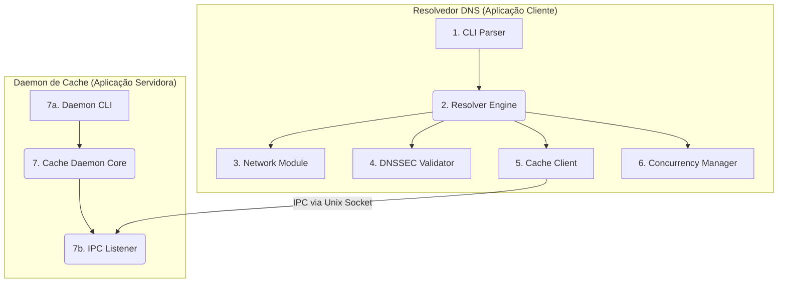

# 1. Visão Geral da Arquitetura

O sistema foi projetado com uma **arquitetura modular e orientada a componentes** para promover a separação de preocupações, testabilidade e manutenibilidade.

Ele é composto por duas aplicações principais: o **Resolvedor DNS (Aplicação Cliente)** e o **Daemon de Cache (Aplicação Servidora)**. A comunicação entre eles é feita via Comunicação Inter-Processos (IPC), utilizando **Sockets de Domínio Unix** для máxima eficiência e segurança em ambiente local.

